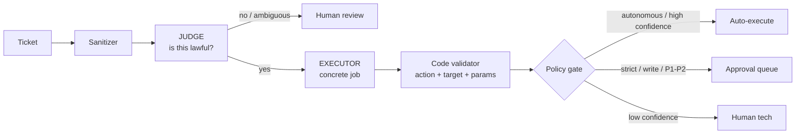

# Autonomy Policy

**Autonomy Policy controls how much the AI may do on its own.** It's a
per-deployment setting: the same BareNOC appliance can run like an autopilot at
a home, a careful assistant at a small business, or a strictly-supervised tool
at a managed-service provider.

Where you set it: **Settings → API Keys → Autonomy Policy** (the block below the
LLM providers). Changes apply to the worker **without a restart** — usually
within one poll cycle (~15 seconds).

## Provider failover (which AI is behind it)

Settings → API Keys → **LLM Providers** arranges the models behind the
assistant as a chain: **Primary → Secondary → Tertiary**. The worker walks the
chain on every LLM call:

- **Failover triggers** — a provider fails, times out (`LLM_TIMEOUT_S`, default
  30 s), or hits too many consecutive failures (`LLM_PROVIDER_DOWN_AFTER`,
  default 3, after which it's skipped until it recovers).
- **Hosted vs on-prem** — each provider is marked **Hosted** (DeepSeek, OpenAI,
  Anthropic, Gemini) or **On-prem** (Ollama / LM Studio on your LAN, `$0`
  pricing). Typical setup: Hosted primary, on-prem Ollama as the ISP-outage
  fallback.
- **Whole chain down** — the worker opens a **P1 ticket** ("LLM provider outage")
  + sends the alert email, deduped until recovery; the ticket auto-closes with
  a recovery note when any provider answers again.
- Each ticket still retries on its own schedule (`LLM_RETRY_INTERVAL_MIN` /
  `LLM_RETRY_MAX_ATTEMPTS`) so a brief blip never kills a ticket.

## The core question

Every ticket the AI works on ends in one of three ways:

1. **Auto-executed** — the AI runs the action itself (e.g. pings a device,
   reads the UniFi controller, generates a report).
2. **Approval queue** — the action is prepared and held for a human tech to
   approve or reject.
3. **Denied / escalated** — the request is judged not lawful or too uncertain,
   and a human reviews it.

The policy decides which of these happens for *which* requests.



## The three profiles

| Profile | Best for | Risk filters | Write actions | Approval queue |
|---------|----------|--------------|---------------|----------------|
| **Autonomous** | Home / owner-operator | **Off** — no keyword forces a judge call | Auto-execute (≥ 0.80 confidence) | **None** — a request is either done or denied with a reason |
| **Balanced** | SMB owner-operator | On | Auto-execute at high confidence (≥ 0.90) | P1 tickets only |
| **Strict** | Tier II / managed service | On | Never auto — always reviewed | All writes + P1/P2 |

- **Autonomous** means the owner never has to approve their own request. "Reboot
  the gateway at 2am" is judged, and if it's lawful it just runs.
- **Strict** means a human sees every write action and every P1/P2 — the AI
  prepares the exact change, the tech approves it.
- **No profile selected ("inherit")** = the original behavior: read-only actions
  auto-run at ≥0.80 confidence, writes go to approval, P1/P2 auto-run only at
  ≥0.95. The two-phase judge is off unless enabled separately.

## What the policy actually toggles

### 1. Risk filters

Risk filters are keyword categories. When a request mentions a keyword in an
active category, it is **always** sent to the judge for a lawfulness ruling —
it can never be auto-approved on pattern alone.

| Category | Covers |
|----------|--------|
| `maintenance` | reboot, restart, patch, upgrade, firmware |
| `security` | block, delete, disable, firewall, ACL |
| `network` | port, VLAN, config |
| `identity` | password, account |
| `install` | installing software |
| `change` | change, reset |

- **All** (default in Balanced/Strict) — every category is active.
- **None** (Autonomous) — keyword rules are disabled; the judge still rules on
  every non-trivial request, but nothing is blocked *just* for mentioning a word.
- **Custom** — pick specific categories (e.g. keep `security` + `identity` on
  but relax `maintenance`).

Plurals and verb forms count ("ports", "rebooting") — the filters are
stem-aware.

### 2. Write-action autonomy

Write actions (reboot, patch, port changes, installs…) either auto-execute at
the configured confidence or land in the approval queue:

- `Write actions auto-execute` **on** → writes run at ≥ the threshold
- **off** → writes always go to approval

### 3. Auto-exec confidence threshold

The minimum confidence (0.0–1.0) for a write action to auto-execute. Higher =
safer but more approvals. Read-only actions still auto-run at ≥0.80 in every
profile.

### 4. Approval priorities

Which ticket priorities always require a human, regardless of confidence.
Typical: `P1,P2` (strict), `P1` (balanced), none (autonomous).

### 5. Patch allowlist

The only firmware/patch IDs the AI may apply (`apply_patch`). Comma-separated
list — or `*` to allow any patch (home deployments). Blank = the built-in
defaults (`FW-6.6.55`, `FW-6.6.52`, `FW-7.0.1`, `UBI-OS-5.1.20`).

### 6. Judge required

Whether the lawfulness judge runs at all. The judge reads the request and rules
**legal / doable / safe / in-scope** before anything executes. Profiles enable
it by default; turn it off only if you understand the trade-off.

## What never changes, no matter the profile

The policy controls **autonomy** (who clicks "go"), not **authority** (what the
AI is allowed to do). These are always enforced in code:

- Only the **approved action catalog** can run (ping, SNMP, device status,
  network reads, reports, reboots, patches, etc.) — no arbitrary commands.
- Targets must be **managed devices** in your inventory.
- Parameters must match **per-action schemas** (e.g. a reboot requires a
  `scheduled_at` time; a patch must be on the allowlist).
- **Every action is audit-logged** with the model, confidence, and cost.

So even in fully autonomous mode, the AI can't invent actions, touch devices
you don't manage, or run anything outside the catalog.

## How requests are decided (the pipeline)

1. **Sanitizer** — blocks prompt-injection patterns.
2. **Judge** (reasoner-class model) — rules on lawfulness: is there an allowed
   action? Is the target managed? Is it safe? Is it in scope? Returns
   `lawful / ambiguous / unlawful`.
3. **Executor** (fast model) — fills in the concrete job, pinned to the
   judge-approved action.
4. **Code validator** — the hard gate: action enum, managed target, param
   schema, patch allowlist.
5. **Policy gate** — applies your profile: auto-execute, approve, or escalate.

Cost controls built in: obviously-safe read-only requests ("is the gateway
online?") short-circuit with **no LLM call at all**, and repeated requests hit
a **verdict cache** (24 h) so the judge isn't re-run on the same question.

## Lily (the AI assistant) — experimental mode

In **Autonomous** mode you can route tickets to **Lily** — the
general-purpose coding agent that runs on the appliance itself — instead of the
caged action pipeline. This is the "real technician" mode: the agent reads the
ticket, then **uses tools** (bash, file access, the BareNOC API, the UniFi
controller) to diagnose, investigate, and act — and writes its findings back
into the ticket thread.

```
Ticket → Queue Manager (Juniper) → Lily (full tools) → output → ticket
```

- **How it works:** the worker writes a `pi_task` job; the on-appliance agent
  runs `pi -p` headlessly with the ticket as the task, using the **same
  provider/model/API key configured in Settings** (read live from `.env`).
  Its final response is posted to the ticket, and the comment/re-run loop
  applies just like the normal pipeline.
- **No barriers in Autonomous:** with `PI_AGENT_ENABLED=true` and the
  **Autonomous** profile, the agent has full tool access with **no approval
  gates** — it can run any command its user account permits and write files.
- ⚠️ **Experimental / risky.** The Settings page shows a warning when
  Autonomous is selected. Only enable this on networks you fully control. The
  agent runs as the restricted `pi-agent` system user (no sudo) with a per-
  ticket session directory and a timeout budget, but the whole point is that
  the barriers are OFF.
- **When to use it:** open-ended work — diagnosis ("phone won't connect"),
  multi-step investigations, anything needing judgment + tool use. For safe,
  repeatable network operations the caged action pipeline is still available
  (and in **Balanced**/**Strict** profiles the caged pipeline is used).

## Which profile should I pick?

| You are… | Pick |
|----------|------|
| Home lab / single owner, you just want it to work | **Autonomous** |
| Small business, you're the operator and want a second pair of eyes on big changes | **Balanced** |
| MSP / Tier II support, customers hold you accountable for every change | **Strict** |

You can always tune further: e.g. Balanced but with `security` risk filters
forced on, writes at 0.95, and P1–P2 approvals.

## Advanced: configuring without the UI

All settings map to `.env` keys (the worker hot-reloads them):

```env
LLM_POLICY_PROFILE=balanced            # autonomous | balanced | strict | (unset = inherit)
LLM_POLICY_RISK_FILTERS=all            # all | none | maintenance,security,network,identity,install,change
LLM_POLICY_JUDGE_REQUIRED=true         # true | false
LLM_POLICY_WRITE_AUTOEXEC=true         # true | false
LLM_POLICY_AUTOEXEC_THRESHOLD=0.90     # 0.0 - 1.0
LLM_POLICY_APPROVAL_PRIORITIES=P1,P2   # comma-separated
PATCH_ALLOWLIST=FW-6.6.55,FW-6.6.52    # comma-separated, or * for any
```

Granular keys override the profile — for example, a Balanced deployment that
wants security keywords to always force the judge stays Balanced but adds
`LLM_POLICY_RISK_FILTERS=all`.

## FAQ

- **"I asked for X and got a denial instead of a request for approval."**
  You're on **Autonomous** — there is no approval queue. The judge decided the
  request wasn't lawful (or too uncertain) and explained why in the ticket.
  Either fix the request or escalate manually.
- **"Why did a write action go to approval instead of running?"**
  Your profile holds writes for review (Strict), the confidence was below the
  threshold (Balanced), or the ticket priority is on your approval list.
- **"Can the AI ever change a firewall or create accounts?"**
  No. Those actions aren't in the catalog, and the code validator rejects them
  in every profile. Judge rulings are policy; the catalog + schemas are law.
- **"Does changing this restart anything?"** No — the worker re-reads the
  policy on its next cycle.
