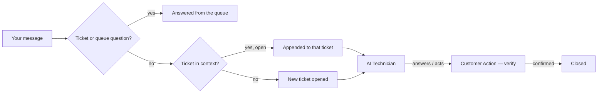

# Chat Client

BareNOC ships an AIM-style desktop chat client — talk to the **Queue Manager (Juniper)**
like a colleague.

The feature can be switched off in **Settings → General → Enable desktop chat client**
(`CHAT_CLIENT_ENABLED`). When disabled, the Downloads page and the chat API return 403
— the desktop client cannot sign in. Turn it back on there at any time.

## Install & launch

- **Linux:** `cd client && ./install.sh` then `barenoc-chat` (or run
  `python3 barenoc_chat.py --server https://<appliance>`).
- **Windows:** `install.bat` (installs + Start Menu/Desktop shortcuts).
- **macOS:** `./install.command` (builds `BareNOC Chat.app`).
- **Standalone binary (no Python):** `build.sh` / `build.bat` (PyInstaller).

## The Queue Manager (Juniper) conversation flow



**What the Queue Manager answers directly:** tickets and the queue — status,
counts, filters ("what's open?", "what's escalated?", "what needs customer
action?", "how many tickets?", "status of TKT-…"), and identity questions
("what's your name?", "who are you?"). Everything else becomes a ticket (new,
or appended to the ticket you're discussing).

**Ticket actions you can speak:**
- "make TKT-… a P1" · "assign TKT-… to bob" · "close TKT-…" · "close this"
- "are there any notes yet?" (about the ticket in context)

## Buddy list

- **☎ Queue Manager** — the main conversation. The chat header shows her name
  + role (**Juniper — Queue Manager**); replies are labeled with her name.
- **Devices** — click a device and message it to open a ticket targeted at it.
- **Tickets** — click a ticket to read its conversation; messages you send are
  appended as comments for the AI/human tech.

## Slash commands

```
/help                 this list
/tickets [filter]     open | in_progress | escalated | customer_action | closed | P1 …
/status TKT-…         full status + conversation for a ticket
/logs [n]             recent activity
/devices              device list
/system               host + queue status
/me                   your account info
/refresh              refresh now
/clear                clear the window
```

## How a request flows

1. You message the Queue Manager (or a device/ticket buddy).
2. Ticket/queue questions → answered immediately.
3. Anything else → ticket opened (or appended) + confirmation with the ID.
4. **AI Technician** picks it up: sanitizes, judges, executes approved actions.
5. Needs a human → **Escalated**. Needs you → **Customer Action**.
6. You verify ("that fixed it") → the AI closes it; updates post in-thread.

> Tip: "what vlans are on my network?" is an info request — the AI Technician
> answers it from the UniFi controller and posts the result in the ticket.
