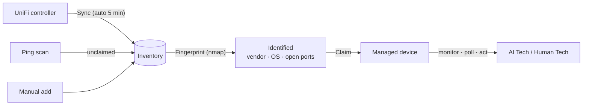
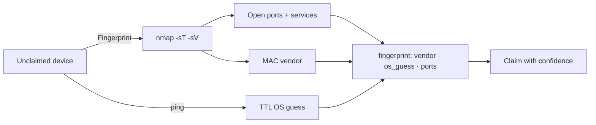

# Devices

Devices enter inventory through **UniFi sync**, **ping scans**, or manual entry,
get **identified** (fingerprinted), and are **claimed** to become managed.

## Device lifecycle

## Unclaimed devices

The Devices page shows unclaimed devices as a compact list (grouped, so they
take less space than the old card grid):

| Section | Source | What to do |
|---------|--------|------------|
| **Network Infrastructure** | UniFi-managed gateways/switches/APs | Take ownership |
| **Endpoints (UniFi clients)** | Computers, servers, phones, IoT seen by UniFi | Identify the unknowns, take ownership |
| **Discovered — unexamined** | Ping-scan finds (non-UniFi sites) | Fingerprint for identity |

Each row shows the name, IP, vendor, type, and tags. Inline actions:
**Fingerprint**, **Identify** (shows the fingerprint + recommended control
channel), **Take ownership**, **Enable control**, **Dismiss**.

> With a UniFi controller active, **Scan Network** is hidden — UniFi is the
> authoritative source. It reappears on deployments without UniFi.

## Fingerprinting

Fingerprinting runs a safe read-only **nmap** scan (top 100 TCP ports + service
detection) from the appliance host and stores the result on the device:

## Claiming a device

## Adopting a device with a certificate (step-ca)

The strongest adoption method: the device gets a **short-lived certificate**
from the appliance's internal CA (step-ca) and proves its identity over **mTLS**
— no shared passwords, no long-lived keys.

1. On the Devices page, hit **🔐 Adopt** on a device → BareNOC mints a
   one-time enrollment token (10 minutes).
2. On the device (with step-cli installed), run the three commands shown in
   the modal: bootstrap the CA by fingerprint, enroll the cert with the token,
   and start posting to `/api/v1/device/report` with the client cert.
3. The first successful report **links** the device (badge 🔐 cert,
   adoption = linked). The cert auto-renews on its short TTL.
4. **Revoke** (same modal) de-trusts the device **instantly** — its report
   calls 403 even while the cert is still within its TTL.

Certificates are issued by the internal CA (`stepca.barenoc.local:8443`); the
API's device endpoints require a client cert signed by that CA root. Devices
without step-cli can still be claimed with SSH (fallback) or adopted via the
UniFi controller — cert adoption is the preferred, revocable path.

**Prefer an endpoint agent?** For servers and workstations you can install
**NOC Agent** — the device dials out over mTLS and runs safe actions locally
(no inbound SSH, no stored credentials). See [NOC Agent](/wiki/noc-agent).

Click **Take ownership** — give it a name, type (gateway/switch/ap/server/
workstation/printer), vendor/model, and optionally SNMP/SSH credentials.
Claimed devices become **onboarded**: they're monitored (ping/status), appear
in dashboards, and are targets for AI Technician actions.

**Claim with control**: paste the device's SSH private key (and SSH user) in
the credentials section — the device is stored encrypted at rest and becomes
**SSH-controlled**: the AI Tech's SSH actions (patch check, collect logs,
reboot, install the chat client) automatically use the stored credentials for
that device. Without a control channel, a claimed device is monitor-only
(ping/status) — still onboarded, with the 🔔 monitor toggle for alerts.

**Add control later**: any onboarded device has a **Connect channel** button —
attach SNMP/SSH credentials to add the `snmp`/`ssh` channels (this also works
for UniFi gear that has no controller access, e.g. a NAS you want patched).
A monitor-only camera/IoT device stays onboarded with just the 🔔 monitor
toggle + ping/status.

**UniFi gear auto-adopts**: once the controller connection works, UniFi-managed
gateways/switches/APs are claimed automatically (Settings → UniFi →
"Auto-adopt UniFi devices") and appear under **Onboarded Devices** — they're
controlled through the controller, no SSH needed. Endpoint *clients* are never
auto-adopted.

## Devices page views

- **Onboarded grid** — every claimed device, regardless of control channels.
  Each card shows its channels (agent · vendor API · SSH · UniFi · SNMP ·
  monitor), the control actions they enable, and a **🔔 / 🔕 monitor toggle**
  to opt the device into email alerts when it goes down and recovers (default:
  off — you pick which devices page you). **Connect channel** on a card opens
  the credentials editor (add/replace SSH or SNMP).
- **Monitored** — a filter chip (🔔 Monitored) in the Onboarded section shows
  only the devices with the monitor toggle ON. It is a view within Onboarded,
  not a separate status: a monitor-only camera/IoT device is Onboarded too.
- **Topology** — the **Topology** button (next to List) renders your adopted
  UniFi gear as a live graph: gateway → switches → APs, with online wired/
  wireless clients attached to their parent device and port numbers on the
  links. Auto-shown when adopted UniFi gear exists.

## Endpoint identification from UniFi

UniFi sync ingests *clients* (not just infrastructure): hostname, MAC vendor,
wired/wireless, online status. Endpoints get a guessed type (server vs
workstation) from hostname/vendor hints — fingerprint confirms it.
