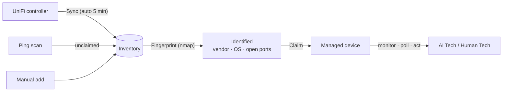
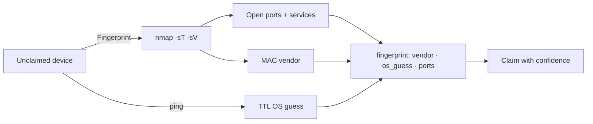

# Devices

Devices enter inventory through **UniFi sync**, **ping scans**, or manual entry,
get **identified** (fingerprinted), and are **claimed** to become managed.

## Device lifecycle

## Unclaimed devices

The Devices page groups unclaimed devices into three sections:

| Section | Source | What to do |
|---------|--------|------------|
| **Network Infrastructure** | UniFi-managed gateways/switches/APs | Claim them |
| **Endpoints (UniFi clients)** | Computers, servers, phones, IoT seen by UniFi | Fingerprint the unknowns, claim |
| **Discovered — unexamined** | Ping-scan finds (non-UniFi sites) | Fingerprint for identity |

Each card shows the IP, vendor, type, tags, and fingerprint result (OS guess +
open ports). Buttons: **Fingerprint**, **Claim**, **Dismiss**.

> With a UniFi controller active, **Scan Network** is hidden — UniFi is the
> authoritative source. It reappears on deployments without UniFi.

## Fingerprinting

Fingerprinting runs a safe read-only **nmap** scan (top 100 TCP ports + service
detection) from the appliance host and stores the result on the device:

## Claiming a device

## Adopting a device with a certificate (step-ca)

The strongest adoption method: the device gets a **short-lived certificate**
from the appliance's internal CA (step-ca) and proves its identity over **mTLS**
— no shared passwords, no long-lived keys.

1. On the Devices page, hit **🔐 Adopt** on a device → BareNOC mints a
   one-time enrollment token (10 minutes).
2. On the device (with step-cli installed), run the three commands shown in
   the modal: bootstrap the CA by fingerprint, enroll the cert with the token,
   and start posting to `/api/v1/device/report` with the client cert.
3. The first successful report **links** the device (badge 🔐 cert,
   adoption = linked). The cert auto-renews on its short TTL.
4. **Revoke** (same modal) de-trusts the device **instantly** — its report
   calls 403 even while the cert is still within its TTL.

Certificates are issued by the internal CA (`stepca.barenoc.local:8443`); the
API's device endpoints require a client cert signed by that CA root. Devices
without step-cli can still be claimed with SSH (fallback) or adopted via the
UniFi controller — cert adoption is the preferred, revocable path.

Click **Claim** — give it a name, type (gateway/switch/ap/server/workstation/
printer), vendor/model, and optionally SNMP/SSH credentials. Claimed devices
become managed: they're monitored (ping/SNMP), appear in dashboards, and are
targets for AI Technician actions.

**Claim with control**: paste the device's SSH private key (and SSH user) in
the credentials section — the device is stored encrypted at rest and becomes
**SSH-controlled**: the AI Tech's SSH actions (patch check, collect logs,
reboot, install the chat client) automatically use the stored credentials for
that device. Without SSH, a claimed device is monitoring-only (ping/SNMP).

**Add control later**: any claimed device that isn't controlled yet (the
*Monitoring Only* section) has an **Add SSH/SNMP** button — or use **Creds**
on any Onboarded card — to attach SNMP/SSH credentials and move it into the
managed fleet (this also works for UniFi gear that has no controller access,
e.g. a NAS you want patched).

**UniFi gear auto-adopts**: once the controller connection works, UniFi-managed
gateways/switches/APs are claimed automatically (Settings → UniFi →
"Auto-adopt UniFi devices") and appear under **Onboarded Devices** — they're
controlled through the controller, no SSH needed. Endpoint *clients* are never
auto-adopted.

## Devices page views

- **Onboarded list** — devices BareNOC can control (SSH **or** UniFi). Click the
  **🔔 / 🔕 bell** on a card to opt that device into email alerts when it goes
  down and when it recovers (default: off — you pick which devices page you).
  **Creds** on a card opens the credentials editor (add/replace SSH or SNMP).
- **Monitoring Only** — claimed devices with **no** SSH credentials and **no**
  UniFi management: they're ping/SNMP monitored but BareNOC can't run actions
  on them. Use **Add SSH/SNMP** to give the AI Tech control.
- **Topology** — the **Topology** button (next to List) renders your adopted
  UniFi gear as a live graph: gateway → switches → APs, with online wired/
  wireless clients attached to their parent device and port numbers on the
  links. Auto-shown when adopted UniFi gear exists.

## Endpoint identification from UniFi

UniFi sync ingests *clients* (not just infrastructure): hostname, MAC vendor,
wired/wireless, online status. Endpoints get a guessed type (server vs
workstation) from hostname/vendor hints — fingerprint confirms it.
