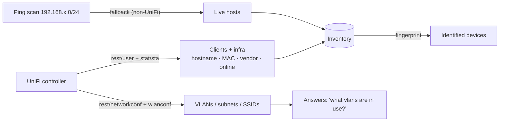
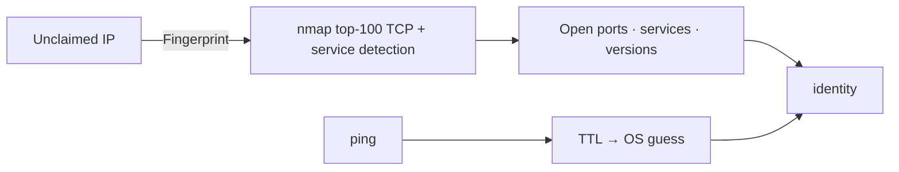

# Network Discovery

Discovery answers one question: **what's on my network?** BareNOC combines the
UniFi controller (authoritative where present), ping scans (fallback), and nmap
fingerprinting (identification).

## Discovery flow

## UniFi sync

- Runs **automatically at the configured interval** (Settings → UniFi →
  Auto-sync, 5–60 min) — the manual **Sync UniFi** button was removed when
  auto-sync landed.
- Pulls infrastructure (gateways/switches/APs) **and** all known clients —
  including offline ones — merging the full client database (`rest/user`) with
  active sessions (`stat/sta`) for live IPs and status.
- New clients become unclaimed devices (type guessed from hostname/vendor);
  managed network gear **auto-adopts** when the controller connection works
  (Settings → UniFi → Auto-adopt).
- You can also ask: **"what vlans are on my network?"** — the AI Technician
  answers from the controller (`network_info`).

## Ping scan

The ping sweep (**Scan Network**) probes the appliance's own /24 (configurable
via `DISCOVERY_SUBNET` in `.env`, default `192.168.0`) for live hosts — used on
deployments **without** a UniFi controller (with UniFi active the button is
hidden; the controller is the authoritative source). It creates unclaimed
devices with no metadata; fingerprint them to identify.

## Fingerprinting

Fingerprint results (vendor, OS guess, open ports) are stored on the device and
shown on its card — so "192.0.2.64" becomes "Proxmox VE server (port 3128)".

## Client → port resolution

For wired clients, UniFi reports *which switch port they're on*. Ask the AI or
use the API: `GET /api/v1/unifi/client/{ip}/port` — e.g. `192.0.2.64` →
Annex Switch **port 7**.
