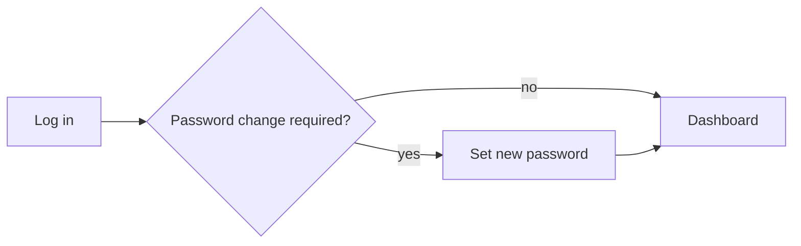
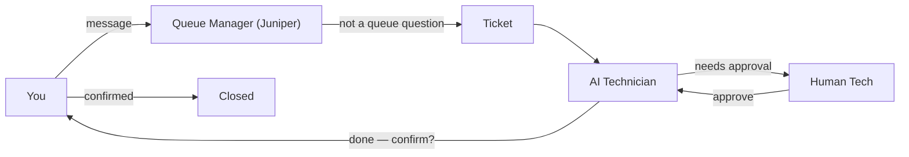

# Getting Started

## First-run setup wizard

On a fresh install you land on the **express setup wizard** — five steps:

1. **Admin account** — create the first admin.
2. **Network** — UniFi controller credentials (with the auto-discover preview right
   there).
3. **Name & share** — site name, the chat URL + QR, and the **LLM choice**:
   **Cloud (recommended — best answers)** vs **Local only (no data leaves your
   network)** — the same egress toggle the [Compliance Controls](/wiki/compliance)
   panel uses.
4. **Updates** — check for new releases, **install now** if one is available,
   and set the **auto-update schedule** (on by default, weekly Sunday 03:00
   local; opt out any time in System → Updates).
5. **Done** — you land on the dashboard with the defaults already applied
   (autonomous AI, UniFi auto-sync on, auto-updates on, alerts off until you
   add a recipient).

Everything you skip gets a **sane default** + a "change it in Settings" link.
If you want the full nine-step flow (timezone, email, autonomy, backups,
adoption, share), open the **"Advanced setup"** expander — it restores the
complete path. Most people never need it.

## Identity & DNS (set at install)

Passkey login needs a **real domain** — Chrome/Edge/Safari refuse passkeys on
`.local`/`.lan`/raw IPs. In **Settings → Identity → Appliance identity & DNS**
set the appliance IP, a domain you own, and the console hostname; the page
shows the exact DNS record / hosts line to add. The appliance also runs a
**split-horizon DNS server** (port 53) that answers for its own names and
forwards everything else — point your router's DNS at it (as a secondary) and
nothing else needs configuring.

## First login

1. Open the portal URL (your admin gave you `https://<appliance>/`).
2. Log in with your BareNOC account.
3. If you were sent to a **change-password** screen, set a new password first.



## Roles

| Role | Can do |
|------|--------|
| **Admin** | Everything: settings, users, integrations (UniFi, email, Pocket ID), approvals |
| **Operator** | Manage devices/tickets, approve actions, run diagnostics |
| **Read-only** | View dashboards, tickets, and device status |

## The three-way flow

- **Queue Manager (Juniper)** (chat persona) — handles tickets and the queue; answers
  ticket questions, opens/assigns/prioritizes/closes tickets. Anything else →
  a ticket.
- **AI Technician** — the worker that reads tickets, decides if a request is
  legal/doable, runs approved actions, and asks you to verify results.
- **Lily** (autonomous, experimental) — in Autonomous mode, tickets
  can be dispatched to the on-appliance coding agent, which works them with
  full tools and writes the outcome into the ticket (see the
  [Autonomy Policy](/wiki/autonomy)).
- **Human Tech** — approves or closes escalated tickets (that's you or your
  team).



## Remote access (Tailscale)

BareNOC and its Proxmox hosts join a **Tailscale** tailnet for remote
management — no open ports, works from anywhere. See the **Remote Access**
card in Settings → General: it shows each node (appliance + Proxmox host),
its `100.x` tailnet IP, and an **Approve this node** link when a node still
needs your Tailscale login.

There is also a **customer-controlled Remote support** toggle in **Settings →
Support** (off by default). It joins the appliance to the BareNOC **support
tailnet** under a tagged, revocable identity so the support team can reach
**this appliance only** (never your LAN). See [Support / Bug Report](/wiki/support).

Once online:

```bash
# from anywhere on your tailnet
ssh ops@<host-100.x-ip>          # Proxmox host (key-only)
ssh barenoc@<vm-100.x-ip>        # BareNOC VM
# web UIs are reachable on the tailnet too (Proxmox 8006, BareNOC 443)
```

## First things to try

- **Ask the chat**: "what tickets are open?" (ticket questions are answered
  directly).
- **Open a ticket**: tell the Queue Manager the problem — it opens one and
  confirms with the ID.
- **Look at your network**: UniFi sync runs automatically (Settings → UniFi →
  Auto-sync, 5–60 min) and auto-adopts the gateways/switches/APs; unclaimed
  devices get grouped (Infrastructure / Endpoints / Discovered) and can be
  **fingerprinted** with nmap to identify them before you **Claim** them.
- **Adopt an endpoint with control**: Claim a device and paste its SSH
  private key (plus user) in the credentials section — it becomes
  **Onboarded**, and the AI Technician can run SSH actions on it (patch
  check, collect logs, reboot).
- **Self-service (no BareNOC login)**: point the device's user at
  `https://<appliance>/onboard` (or the QR) — one-click script that creates
  the dedicated `barenoc` account, installs a short-lived device certificate
  and a heartbeat; the device self-registers as **Onboarded 🔐** within a
  minute. No tech required per machine.
- **Track it**: "status of TKT-…" in chat, or the Tickets page.

## Where things live

| URL | Purpose |
|-----|---------|
| `/` → `/dashboard` | Portal home |
| `/tickets` | Ticket queue |
| `/devices` | Device inventory + onboarding |
| `/settings` | Settings (General · Network · Devices · Tickets · Updates · Backups — everything else under **Advanced**) |
| `/wiki` | This wiki |

> **Tip:** if you ever see "Invalid or expired token", your session (60 min)
> expired — log back in; the app redirects you automatically.
