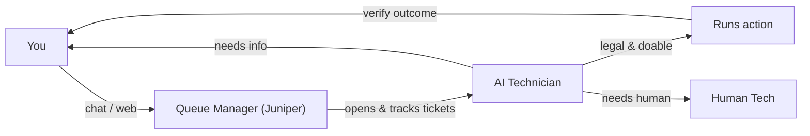

# BareNOC User Wiki

Welcome to the BareNOC operations appliance — the self-hosted NOC for small and
medium businesses. It watches your network, answers questions about it, runs
safe diagnostic actions, and tracks everything as tickets, with an AI assistant
handling the routine work.

## The workflow at a glance

## Pages

| Page | What it covers |
|------|----------------|
| [Workflows](/wiki/workflows) | The full workflow diagrams (tickets, AI pipeline, discovery, security, backups) |
| [Getting Started](/wiki/getting-started) | Logging in, roles, first steps |
| [Tickets](/wiki/tickets) | Lifecycle, priorities, approvals, statuses |
| [Devices](/wiki/devices) | Adding, discovering, claiming, and managing devices |
| [Network Discovery](/wiki/discovery) | UniFi sync, ping scans, nmap fingerprinting |
| [Chat Client](/wiki/chat-client) | The AIM-style desktop chat app |
| [Security](/wiki/security) | Passwords, passkeys, management lockdown |
| [Autonomy Policy](/wiki/autonomy) | How much the AI may do on its own — per deployment |

## Three roles

| Role | What it does |
|------|--------------|
| **Queue Manager (Juniper)** | The chat persona you talk to — handles tickets and the queue only; everything else becomes a ticket |
| **AI Technician** | Reads tickets, judges what's safe/doable, runs approved actions, asks you to verify, escalates to a human |
| **Human Tech** | Approves and closes escalated tickets — you |

If you're new here, start with **[Getting Started](/wiki/getting-started)**, then
the **[Workflows](/wiki/workflows)** page for the big picture.
