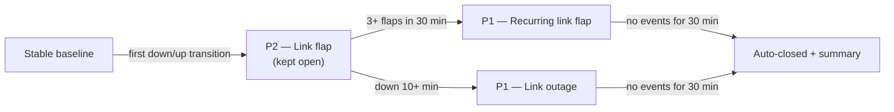

# Link Stability

The link-stability monitor watches network **links and interfaces** for
flapping and outages, and opens a single **graduated ticket** per troubled
link. It's separate from device ping monitoring and the internet probe — this
one answers "a link keeps going down".

## What's monitored

- **Gateway WAN** — always monitored.
- **Every other link** — monitored when the device has the **🔔 monitor toggle**
  on (Devices → Onboarded → per-device toggle). Turning the toggle off stops
  watching that device immediately (any open episode is closed).

Data sources, merged automatically: the UniFi controller (gateway WAN health +
per-port status), SNMP interface status (for devices with SNMP), and the
device's online/offline status as a fallback.

## The graduated ticket lifecycle

| Stage | Trigger | Result |
|-------|---------|--------|
| **Flap** | A link transitions down→up (or up→down) from a known-good baseline | P2 ticket opens, kept open |
| **Recurrence** | 3+ flaps within the 30-minute window | Same ticket escalates to P1 |
| **Outage** | The link stays down longer than 10 minutes | Same ticket escalates to P1 |
| **Stable** | No further events for 30 minutes | Ticket auto-closes with a summary note |

The thresholds are configurable by an admin (defaults: 30-min window, 3 flaps,
10-min down, 30-min stable).

## WAN and internet outages

The WAN flap ticket **is** the internet-outage ticket — when the internet probe
confirms a real outage, it promotes the open WAN flap ticket to P1 instead of
opening a duplicate "Internet connectivity down" ticket. Recovery closes it.

## Persistence

Link episodes are persisted, so a container restart resumes an in-flight
episode instead of losing it or double-alerting.

## Who sees what

- Tickets are system-generated (`source=auto`) and visible to all roles.
- The 🔔 per-device toggle is set on the Devices page (operator/admin).
- Email alerts (down / P1 / recovery / stable) go to the alert recipients,
  best-effort (SMTP required).
