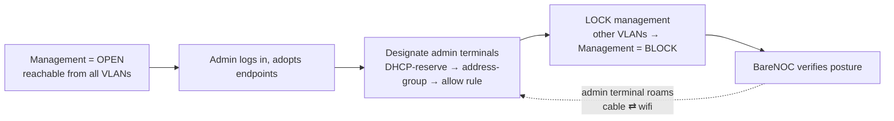

# Security

BareNOC is designed as a deployment appliance — security starts **open** so the
first admin can log in and adopt endpoints, then **locks down** as devices get
designated.

## Management access lifecycle

| Phase | What's allowed | When |
|-------|----------------|------|
| **Open** | Everyone can reach the portal from any VLAN | Fresh deployment — first login + adoption |
| **Locked** | Only designated admin terminals + the BareNOC VM + the ops plane | After onboarding completes |

**Admin terminals are identified by MAC → DHCP-reserved IP → address-group**,
so a designated laptop keeps management access whether it's cabled or on wifi
(and guest networks still block even admin MACs).

## Accounts & secrets

- **Passwords** are bcrypt-hashed (never recoverable); you set a new one on
  first login if flagged.
- **Integration secrets** (LLM keys, SMTP, UniFi, OIDC) live in the appliance
  `.env` (`0600`) and are **masked** in the UI — never shown after save.
- **App-data backups are `0600`** — the archives contain `.env` + the Fernet
  key + the DB (password hashes), so they are never world-readable
  (`src/scripts/backup_app.sh` enforces it).
- **Service account** — the Pi Agent Runner/scripts/scheduler use a dedicated
  `agent` role (Settings-provisioned credential file `0600`): it can fetch
  device credentials and run the UniFi write endpoints it needs, but is NOT
  admin and NOT a technician (human staff with technician/operator accounts
  cannot fetch decrypted SSH keys).
- The **pi-agent provider key** is kept in a dedicated secrets file
  (`/opt/barenoc/volumes/secrets/llm_provider.json`, `0640 root:pi-agent`),
  rewritten by the API whenever Settings change and at startup — so the
  on-appliance coding agent always uses the same provider/model/key
  configured in Settings without reading the whole `.env`.
- **Device credentials** are encrypted at rest (Fernet).
- **Sessions** use a short-lived access token + a revocable refresh session —
  see [Authentication & sessions](#authentication--sessions) below.

## Authentication & sessions

BareNOC mints **two tokens** at login:

| Token | Lifetime | Storage | Revocable |
|---|---|---|---|
| **Access** (JWT) | **60 minutes** | browser cookie (JS-readable) + localStorage | via `token_version` only (password change / forced logout) |
| **Refresh** (JWT) | **7 days** | `HttpOnly` cookie (never JS-readable) | **instantly**, per-session |

- **Revocable refresh sessions** — every login records a row in the
  `auth_sessions` table (bound to the refresh token's `jti`). `/refresh`
  validates that row (must exist, belong to the user, be unrevoked and
  unexpired) before issuing a new access token.
- **`/logout` is instant** — it marks the session row revoked immediately, so
  a logged-out refresh token can never be replayed. The (stateless) access
  token expires on its own within its 60-minute window.
- **Password change kills everything** — changing your password bumps your
  `token_version`, which invalidates *every* outstanding access + refresh
  token (and revokes all session rows) at once. You must sign in again.

### Cookies

- `access_token` — JS-readable (the chat SPA reads it into localStorage),
  `SameSite=Lax`.
- `refresh_token` — **`HttpOnly`** (browsers never expose it to JS),
  `SameSite=Lax`.
- Both are **`Secure`** when the client is on HTTPS (nginx TLS in production;
  plain-HTTP LAN/dev harnesses keep them insecure so the flow still works).

### Fail-closed JWT rules

Every protected API path rejects a token unless ALL of these hold — anything
else is `401`:

1. **`type` == `access`** — refresh / OIDC-flow tokens never authenticate an
   API path (even though they are signed by the same key).
2. **`ver` matches the user's `token_version`** — a token minted before the
   last password change / forced logout is rejected outright.
3. The token is **well-formed, unexpired, and the user is active**.

Malformed, expired, revoked, wrong-type, or wrong-version tokens → **401**
(fail closed — never fall back to guest access).

### CSRF posture

BareNOC has no cross-origin trust to exploit, and state changes are not
reachable via "simple" cross-site requests:

- **JSON-only API bodies** — write endpoints require
  `Content-Type: application/json`; HTML forms can't send that cross-origin
  without a CORS preflight.
- **No CORS middleware** — browsers refuse cross-origin reads (and non-simple
  cross-origin writes) by default.
- **No `Form()` endpoints** — nothing accepts
  `application/x-www-form-urlencoded`.
- **`SameSite=Lax` cookies** — the session cookie is not sent on cross-site
  sub-requests (top-level navigations still work for login/callback flows).
- **GET audit (2026-08-25)** — every `@app.get` / `@router.get` handler was
  swept for state changes (DB writes, config/secrets writes, external calls
  with side effects). All reads confirmed clean for health, wiki, downloads,
  dashboard reports, settings/status, UniFi, tickets, devices, firmware,
  metrics, network-opt, updates, and the onboarding portal, with three
  findings resolved:
  - **`GET /api/v1/chat/messages`** used to mark messages read — read-marking
    moved to **`POST /api/v1/chat/messages/read`** (the GET is now a pure read).
  - **`GET /api/v1/devices/control-key` + `GET /onboard/script`** lazily
    generated the appliance control keypair on first call — the keypair is now
    generated at **startup**, so those GETs are pure reads.
  - **`GET /api/v1/auth/oidc/callback`** writes DB state by design (it
    completes the OIDC passkey login). It **cannot** be a POST — the identity
    provider redirects back with a GET — so it is protected by the OAuth
    `state` + PKCE verifier validation and a one-time authorization code.

### Lily trust (autonomous, experimental)

When Autonomous mode + Lily is enabled, the on-appliance agent runs
tickets with **full tool access and no approval gates** — this is
intentionally risky. The mitigations that remain:

- It runs as the restricted **`pi-agent`** system user (no sudo, limited
  capabilities) with `ProtectHome=no` in its unit so it can reach its runtime
  under `/home/pi-agent`.
- It uses the **same provider/API key configured in Settings** (read live
  from `.env`, never a separately-managed credential).
- It works in a per-ticket **session directory** under `/opt/barenoc/pi-work`
  with a **timeout budget** (default 10 minutes) and its output is capped.
- Every result is **audited** into the ticket and the audit log.

Only enable this on networks you fully control — see the
[Autonomy Policy](/wiki/autonomy).

## Compliance controls (Security panel)

Settings → **Security** ships a toggleable compliance/governance panel — the
artifact a regulated workspace shows an auditor. It covers **MFA
enforcement**, **LLM egress** (cloud vs local-only), telemetry, remote-support
consent, retention, the audit log, session policy, and data deletion, plus a
one-click **Compliance baseline** preset and an **attestation snapshot**
export. See [Compliance Controls](/wiki/compliance).

### MFA enforcement

When **MFA enforcement** is on, a password-only admin/operator login returns
**401** with an MFA prompt — a second factor (passkey or TOTP) is required.
Passkey (Pocket ID) sign-in is already strong auth and is unaffected; TOTP is
the fallback, enrolled in Settings → Security → MFA (authenticator app,
verification required before it activates).

### Session policy & lockout

- **Idle timeout** (strict): the refresh session dies after 30 idle minutes;
  the access token lives out its own ≤60-minute window.
- **Login lockout** (strict): 5 failed password attempts → account locked for
  15 minutes (HTTP 423). The lockout is checked **before** password
  verification (no timing oracle).

### Audit viewer

Sidebar → **Audit Log** lists every event, exports JSON, and **verifies the
hash chain** (each row recomputed against its recorded predecessor). The
`Audit log` toggle gates recording.

## Passkeys (Pocket ID)

With Pocket ID enabled, the login page offers **Sign in with passkey**:

1. Admin enables Identity in Settings and registers the OIDC app.
2. Users enroll a passkey on first login — **save your recovery codes**.
3. Role comes from the Pocket ID group at every login
   (`barenoc-admins` → admin, `barenoc-operators` → technician).

## Network hardening

- UniFi firewalling: **guest and automation VLANs are blocked from internal
  networks**; WiFi → services allowed (DNS/web); Production → Storage allowed.
- The **Management VLAN** (once locked) is the ops plane: Proxmox mgmt,
  BareNOC, admin terminals. Nothing administrative rides the service VLAN.

## Guardrails on the AI

- **Prompt-injection sanitizer** on ticket content before the LLM sees it.
- **Action allowlist** — the LLM can only choose from approved actions.
- **Confidence gates** — low confidence escalates to a human; writes (reboots,
  patches, port changes) require human approval.
- **Immutable audit trail** — every event is hashed into the audit log.
