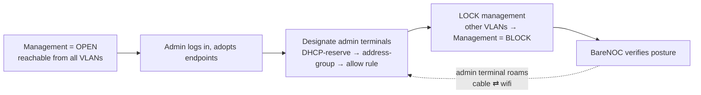

# Security

BareNOC is designed as a deployment appliance — security starts **open** so the
first admin can log in and adopt endpoints, then **locks down** as devices get
designated.

## Management access lifecycle

| Phase | What's allowed | When |
|-------|----------------|------|
| **Open** | Everyone can reach the portal from any VLAN | Fresh deployment — first login + adoption |
| **Locked** | Only designated admin terminals + the BareNOC VM + the ops plane | After onboarding completes |

**Admin terminals are identified by MAC → DHCP-reserved IP → address-group**,
so a designated laptop keeps management access whether it's cabled or on wifi
(and guest networks still block even admin MACs).

## Accounts & secrets

- **Passwords** are bcrypt-hashed (never recoverable); you set a new one on
  first login if flagged.
- **Integration secrets** (LLM keys, SMTP, UniFi, OIDC) live in the appliance
  `.env` (`0600`) and are **masked** in the UI — never shown after save.
- **App-data backups are `0600`** — the archives contain `.env` + the Fernet
  key + the DB (password hashes), so they are never world-readable
  (`src/scripts/backup_app.sh` enforces it).
- **Service account** — the Pi Agent Runner/scripts/scheduler use a dedicated
  `agent` role (Settings-provisioned credential file `0600`): it can fetch
  device credentials and run the UniFi write endpoints it needs, but is NOT
  admin and NOT operator (human staff with operator accounts cannot fetch
  decrypted SSH keys).
- The **pi-agent provider key** is kept in a dedicated secrets file
  (`/opt/barenoc/volumes/secrets/llm_provider.json`, `0640 root:pi-agent`),
  rewritten by the API whenever Settings change and at startup — so the
  on-appliance coding agent always uses the same provider/model/key
  configured in Settings without reading the whole `.env`.
- **Device credentials** are encrypted at rest (Fernet).
- **Sessions** are 60-minute JWTs — expired sessions redirect you to login.

### Lily trust (autonomous, experimental)

When Autonomous mode + Lily is enabled, the on-appliance agent runs
tickets with **full tool access and no approval gates** — this is
intentionally risky. The mitigations that remain:

- It runs as the restricted **`pi-agent`** system user (no sudo, limited
  capabilities) with `ProtectHome=no` in its unit so it can reach its runtime
  under `/home/pi-agent`.
- It uses the **same provider/API key configured in Settings** (read live
  from `.env`, never a separately-managed credential).
- It works in a per-ticket **session directory** under `/opt/barenoc/pi-work`
  with a **timeout budget** (default 10 minutes) and its output is capped.
- Every result is **audited** into the ticket and the audit log.

Only enable this on networks you fully control — see the
[Autonomy Policy](/wiki/autonomy).

## Passkeys (Pocket ID)

With Pocket ID enabled, the login page offers **Sign in with passkey**:

1. Admin enables Identity in Settings and registers the OIDC app.
2. Users enroll a passkey on first login — **save your recovery codes**.
3. Role comes from the Pocket ID group at every login
   (`barenoc-admins` → admin, `barenoc-operators` → operator).

## Network hardening

- UniFi firewalling: **guest and automation VLANs are blocked from internal
  networks**; WiFi → services allowed (DNS/web); Production → Storage allowed.
- The **Management VLAN** (once locked) is the ops plane: Proxmox mgmt,
  BareNOC, admin terminals. Nothing administrative rides the service VLAN.

## Guardrails on the AI

- **Prompt-injection sanitizer** on ticket content before the LLM sees it.
- **Action allowlist** — the LLM can only choose from approved actions.
- **Confidence gates** — low confidence escalates to a human; writes (reboots,
  patches, port changes) require human approval.
- **Immutable audit trail** — every event is hashed into the audit log.
