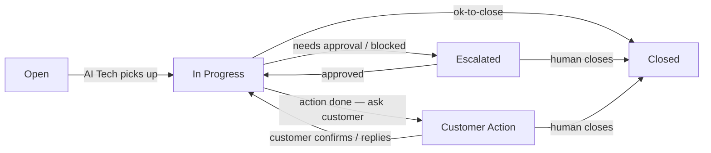
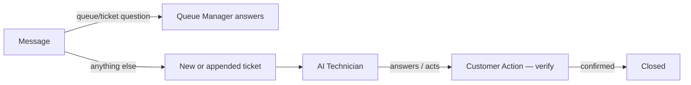

# Tickets

Tickets are the heart of BareNOC — every request, alert, or task becomes a
ticket tracked from open to resolution by the **Queue Manager**, **AI
Technician**, and **Human Tech** roles.

## Lifecycle

| Status | Meaning | Who moves it |
|--------|---------|--------------|
| **Open** | New, not yet picked up | created by user/alert |
| **In Progress** | AI Technician working | AI |
| **Escalated** | Waiting on a human tech (approval, guidance, or failure) | AI |
| **Customer Action** | Waiting on the customer (feedback, info, or closeout) | AI |
| **Closed** | Done — by a human, or by the AI on customer confirmation | human / AI |

Closure rule: tickets are closed by a **human** (tech or customer) or by the
**AI** when the customer confirms the outcome ("ok to close").

## Priorities

| Priority | Meaning | Handling |
|----------|---------|----------|
| **P1** | Outage — critical service down | Highest; escalated immediately |
| **P2** | Major issue, workaround possible | High; fast-tracked |
| **P3** | Routine request | Standard queue |
| **P4** | Minor / cosmetic | Lowest priority |

## Opening a ticket

- **Web app:** Tickets → **New Ticket** — title, description, priority, device.
- **Chat client:** just tell the Queue Manager the problem — it opens a ticket
  (or appends to the one you're discussing) and confirms with the ticket ID:
  - "the internet is down"
  - "Please tag production and storage vlans on the interface to 192.0.2.64"
  - or explicitly: `/new !P2 internet is down | details`

## Tracking

- **Chat:** `/status TKT-…`, "what's the status of TKT-…", or "are there any
  notes yet?" (about the ticket in context).
- **Web:** the ticket view shows the full conversation (work notes), the action
  the AI chose, confidence, model, and resolution.
- **Queue views:** "what tickets are open", "what's escalated", "what needs
  customer action", "closed tickets".

## Approvals & escalations

> How much needs a human at all is set per deployment in the
> **[Autonomy Policy](/wiki/autonomy)** — autonomous (home) runs approved
> actions itself; strict (Tier II) puts every write + P1/P2 in the approval
> queue.

- Actions that need a human (reboots, patches, port changes, anything unusual)
  move the ticket to **Escalated** — review and **Approve**, **Retry**, or
  **Reject/Close** from the ticket view.
- If the AI needs **your input**, the ticket moves to **Customer Action** with
  its question in the thread — reply right there and the AI continues.

## AI Technician notes

Every step is recorded in the ticket's work notes with timestamps and actor:
`processing`, `llm_response`, `auto_execute`, `agent_completed`,
`ai_tech_feedback`, `escalated`, `customer_input`, `completed` (close).
