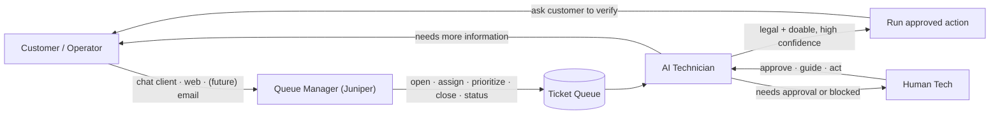
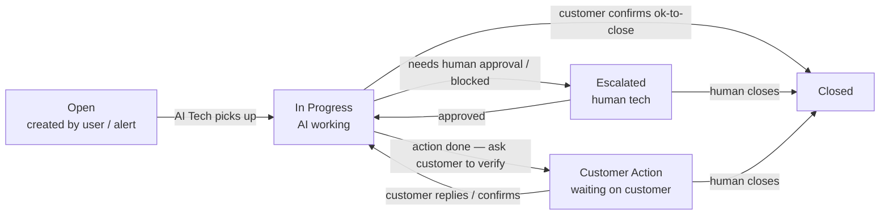
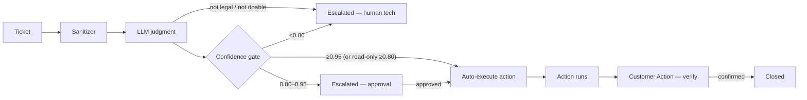
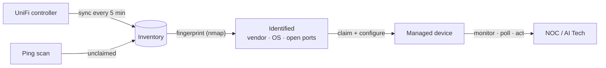
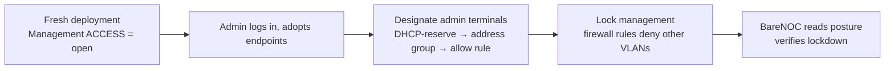
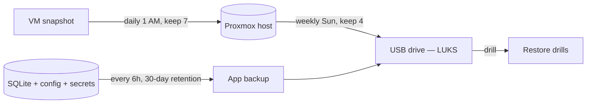
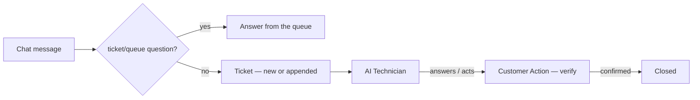

# Workflows

This page maps the core BareNOC workflows. Every diagram is interactive in your
browser — the same flows drive the appliance day-to-day.

## The three roles

BareNOC separates the people/agents in the loop:

| Role | Does | Never does |
|------|------|-----------|
| **Queue Manager (Juniper)** (chat persona) | Answers ticket/queue questions; opens, assigns, prioritizes, closes tickets; status updates | Pretends to know network facts — everything else becomes a ticket |
| **AI Technician** (worker) | Reads tickets, judges "legal/doable", runs approved actions, asks the customer to verify, escalates to human tech | Guesses or acts outside the approved action list |
| **Human Tech** (you) | Approves, retries, or closes escalated tickets; guides the AI | — |
| **Lily** (autonomous, experimental) | Reads tickets and works them with full tools (bash, API, controller) — diagnosis, investigation, multi-step tasks — then writes the outcome into the ticket | Only used in **Autonomous** mode with `PI_AGENT_ENABLED`; nothing is gated in this mode (see the Autonomy Policy) |

> How much the AI may do *without* a human is a per-deployment choice — see the
> **[Autonomy Policy](/wiki/autonomy)** (autonomous / balanced / strict), including
> the experimental **Lily** mode.

## Ticket lifecycle

## AI Technician pipeline

## Discovery & device onboarding

## Management-plane onboarding lockdown

## Backups

## Chat answer-or-escalate

## Monitoring & alerts

- **Device reachability** — the scheduler health-checks the fleet (ping/SNMP/
  UniFi status); devices you opt in via the 🔔 bell get DOWN / RECOVERED
  **emails** (no ticket — by design).
- **Internet / ISP link** — the alert engine probes the LAN gateway + a public
  host (`1.1.1.1`) every minute. The UniFi gateway stays ONLINE during an ISP
  outage (only WAN dies), so device monitoring alone would never catch it.
  On 3 consecutive probe failures it opens a **P1 "Internet connectivity down"
  ticket** + alert email (distinguishes ISP/service vs link/physical), and
  auto-closes it when connectivity returns. Config: `INTERNET_PROBE_*` in
  `.env` (Settings-independent for now).
- **LLM provider outage** — if the whole provider chain is down, the worker
  opens a deduped **P1 ticket** + alert email (see [Autonomy](/wiki/autonomy)).
- **Ticket lifecycle** (Settings → Tickets) — tickets handed to a human
  (escalated) or waiting on the customer get a **check-in** note + email every
  per-priority interval (P1 hourly, P2 4 h, P3/P4 daily); tickets the AI
  resolved are **auto-closed** after a per-priority hold (default 3 days). Both
  are fully configurable per priority, and the audit trail records
  `ticket_checkin` / `ticket_autoclosed`.
- **Reporting** — the Dashboard's **Performance & Reporting** section tracks
  action time (first response + resolution), escalations, closures, reopens,
  auto-closes and LLM cost; charts (created vs resolved, priority mix,
  resolution time) and **CSV/PDF downloads** for business reporting.

---
*See [Tickets](/wiki/tickets) for status details, [Chat Client](/wiki/chat-client)
for the messaging flow, and [Security](/wiki/security) for the lockdown design.*
